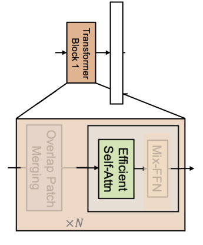

### SegFormer Model - a Transformer based framework for semantic segmentation.


Nguyen Hoang-Phuong

---

### Content: 

- Vision Transformer
- Segformer Model:
  - Encoder
  - Decoder
---
### Vision Transformer


- Split an image into patches
- Flatten the patches
-  Linear embeddings from the flattened patches
- Add positional embeddings
- Feed the sequence into transformer encoder
- Using multi layer perceptron MLP to get classification head

---
### Vision Transformer

- ViT  understands the local and global features
- CNN focus on the local features
- ViT has a higher precision rate on a large dataset
---
### Segformer Model


<!--  -->

SegFormer has the following notable points:
- Encoder: Mix Transformer (MiT) that extracts coarse and fine features
- Decoder: MLP network to directly fuse the multi-level features of the encoder part and predicts the semantic segmentation mask

---
### Encoder 
#### Hierarchical Feature Representation

- ViT that can only generate a single-resolution feature (one head)
- MiT generate multi-level features (MiT have 4 heads)

#### Overlapped Patch Merging

- In ViT, a image input is splitted into **partition** patches. 
- Mix Transformer, a image input is splitted into **overlapping**  patches.

---
### ViT model 


---
### Segformer model 


---
### Segformer model 


---
### Encoder
- With the overlapping patches, the MiT are using a CNN layer. 
That helps the model learn better the local feature.

Is that why we call Mix Transformer? 

- Multi-level features idea is one of the most important ideas for the semantic segmentation model.

---
### Encoder




- ViT uses Multi Head Attn (Computation of $O((H \times W)^2)$)
- MiT uses Efficient Self Attn (Computation of $O((H \times W)^2/R)$)

---
### Encoder


- ViT uses MLP and GELU activation function.
- MiT uses
$$x_{out} = MLP(GELU(CONV_{3 \times 3}(MLP(x_{in})))) + x_{in}$$
- MLP = nn.Linear(dim, num_classes) (or Dense Layer)
- One again, MiT uses a CNN. 


---
### Decoder

Because Encoder is quite good, then to avoid the overfitting, we use a MLPs to fuse the features of the encoder and predict the semantic segmentation mask.


--- 
### A MLP of decoder part

```python
class SegFormerDecoderBlock(nn.Sequential):
    def __init__(self, in_channels: int, out_channels: int, scale_factor: int = 2):
        super().__init__(
            nn.UpsamplingBilinear2d(scale_factor=scale_factor),
            nn.Conv2d(in_channels, out_channels, kernel_size=1),
        )
```
---

### performance of Segformer


Segformer works well on a large dataset.

--- 

### References

- [SegFormer: A Transformer-based Framework for Semantic Segmentation](https://xieenze.github.io/segformer.pdf)
- [Training the Segformer model by using Pytorch Lightning and HuggingFace](https://hphuongdhsp.github.io/ml-blog/pytorchlightning/intancesegmentation/deeplearning/mmdetection/2022/08/07/segmentation-model-part6.html)
- [Usage of TensorFlow based SegFormer in hugs transformers](https://github.com/deep-diver/segformer-tf-transformers)